# Modelamiento y Validación 

Una vez generado nuestro proyecto de Ecore Modeling, podemos comenzar a modelar nuestro dominio. Para ello, se debe seguir los siguientes pasos:

1.  Accedemos al Viewpoint Modeling para generar nuestro dominio
 
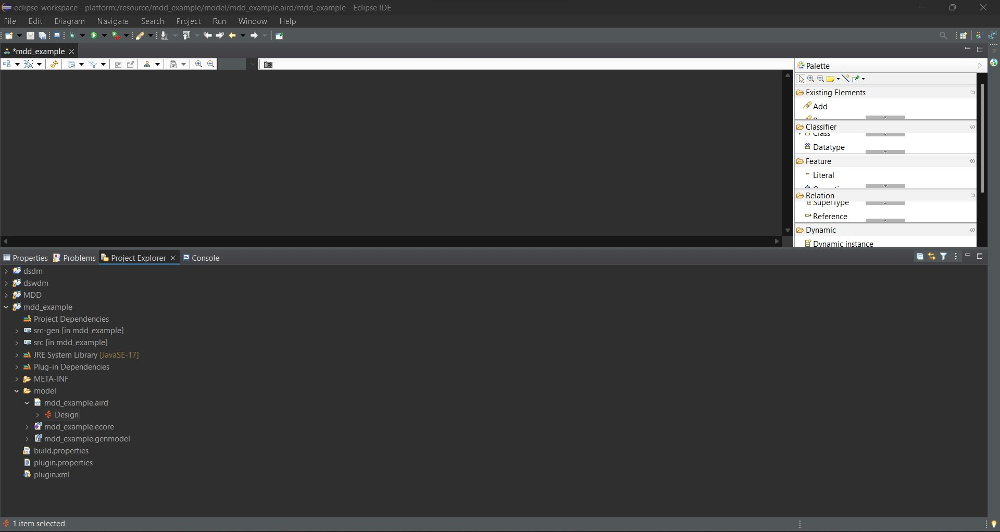

2. Para generar una entidad debemos seleccionar la opción **Class** del apartado **Classifier** y arrastrarla al diagrama de clases (Panel **Palette**).
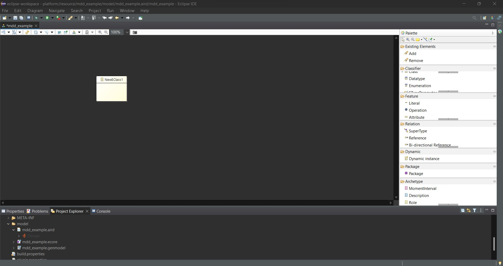

3. Para cambiar el nombre de la entidad, debemos dar doble click sobre la entidad y escribir el nombre deseado en el apartado **name**.

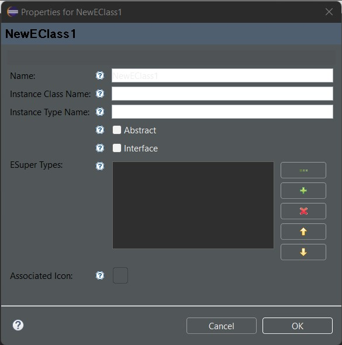

4. Para agregar un atributo a la entidad, debemos seleccionar la entidad y seleccionar la **quinta opción** con lo que se agregara un atributo a la entidad.

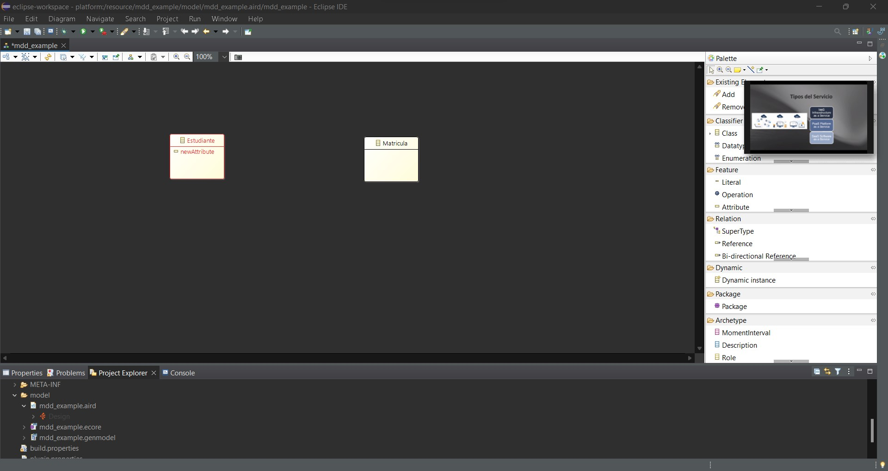

5. Para definir un nombre al atributo debemos dar doble click sobre el atributo y escribir el nombre deseado en el apartado **name**.

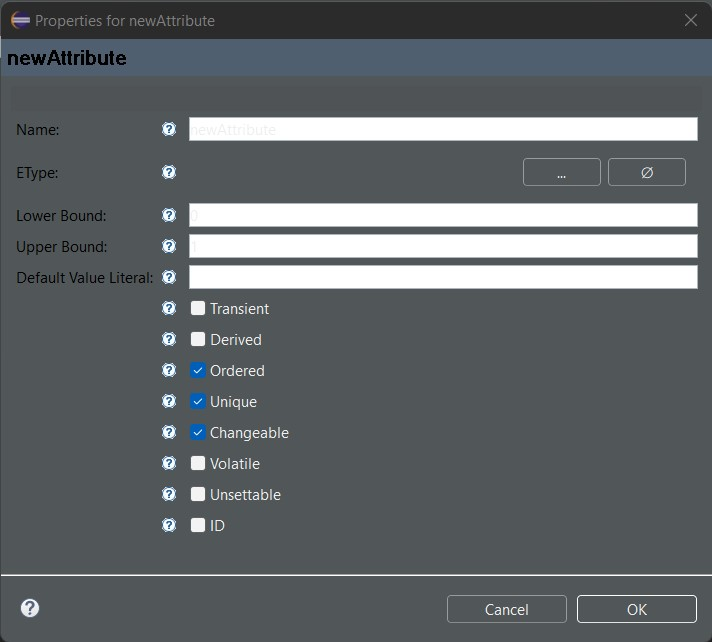

6. Para definir un tipo de dato al atributo debemos dar doble click sobre el atributo y seleccionar la opción **...*** ubicada en **EType**

7. Se desplegará una ventana con los tipos de datos disponibles, seleccionamos el tipo de dato deseado ** ** y seleccionamos la opción **OK**.

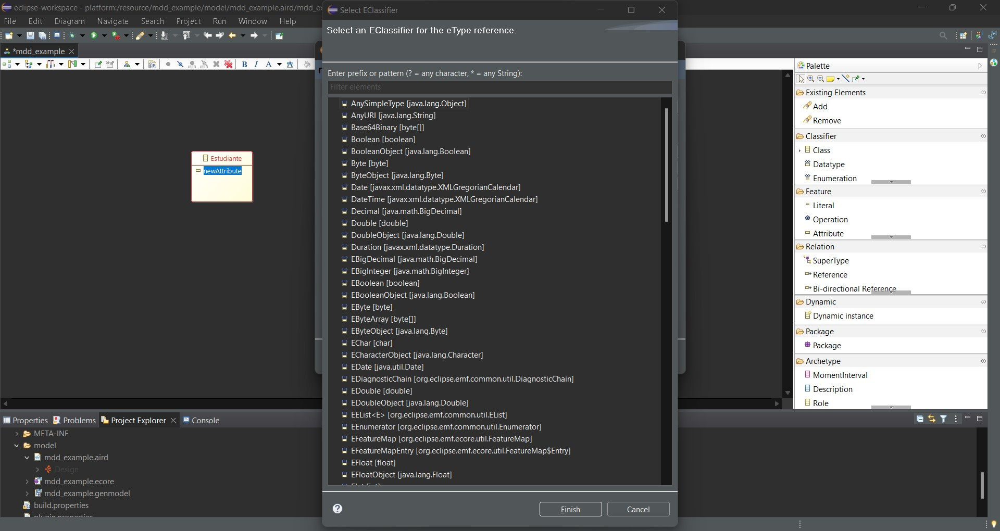

8. Para agregar una relación entre entidades en el panel **Palette** seleccionamos la opción **Relation** al seleccionar la **Relation** debemos dar click en la entidad origen y luego en la entidad destino.

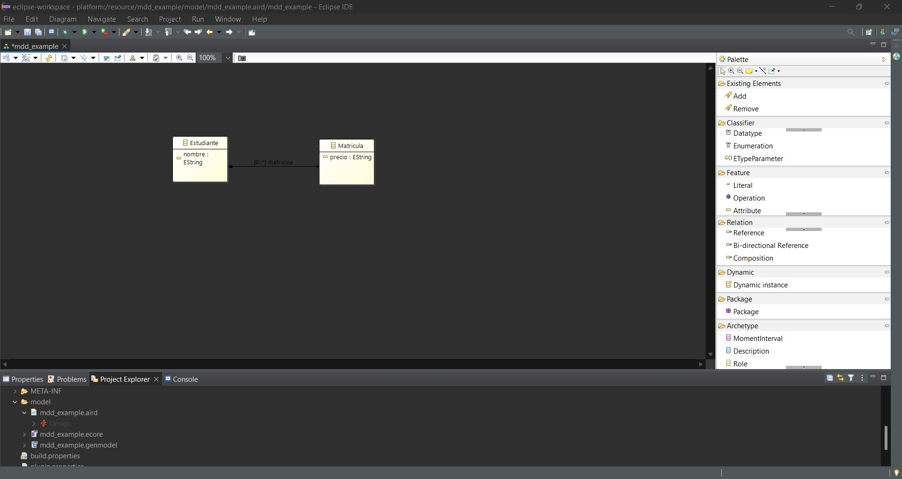

9. El proceso sigue con la generación de los diversos modelos 
   - En el explorador del proyecto dar doble click en la opción **nameModel.genmodel**, luego dar click derecho sobre la opción nameModel e ir generando en orden secuencial cada una de las opciones que inician con la palabra **Generate**. 
    1. Generate Model Code
    2. Generate Edit Code
    3. Generate Editor Code

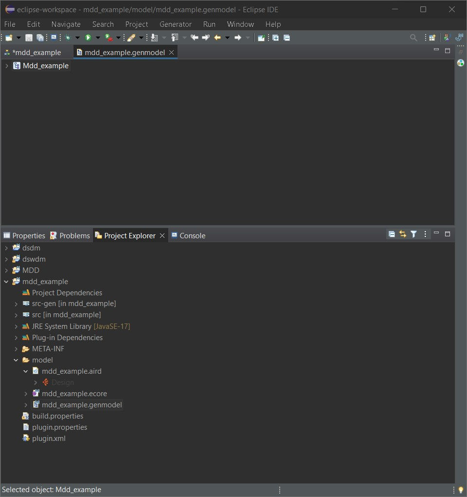

10. Se nos generaran diversos proyectos con terminanciones **.edit** y **.editor**

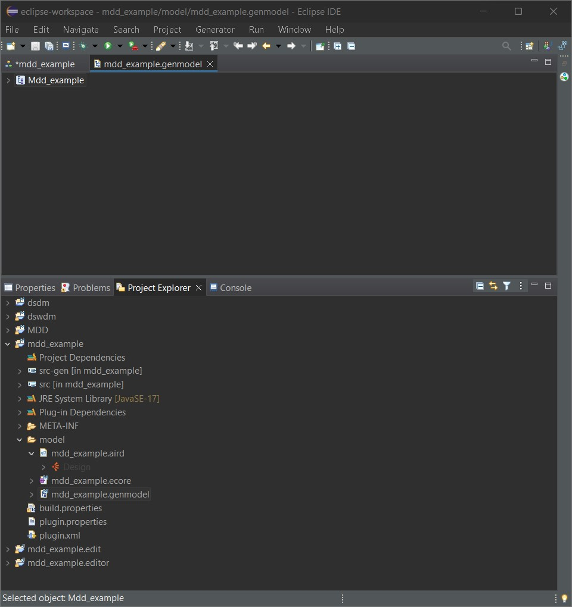

11. Para validar debemos dar click derecho sobre el proyecto **nameModel.editor** y seleccionar la opción **Run As > Eclipse Application**. Donde se nos desplegará una nueva ventana de Eclipse con el editor de nuestro modelo.

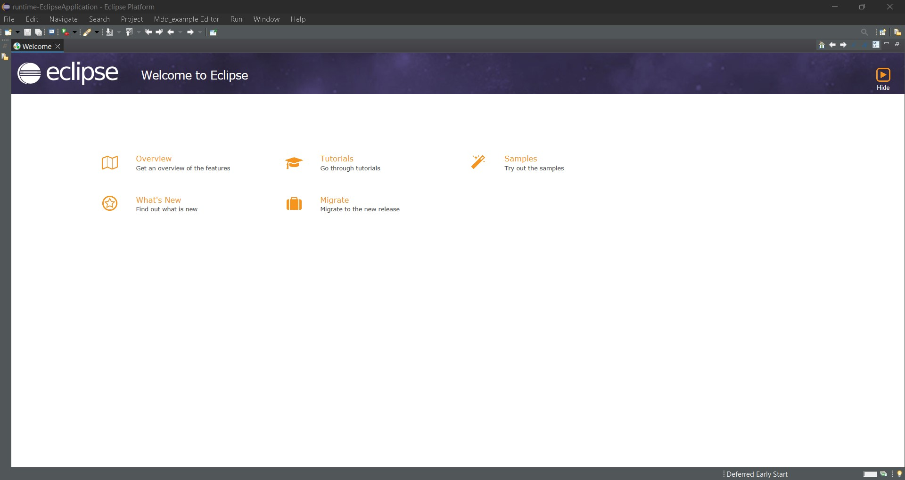

12. Creamos un nuevo proyecto general accediendo a la opción **File > New > Project** y seleccionamos la opción **General > Project**. Luego definimos un nombre en la ventana seleccionamos la opción **Finish**.

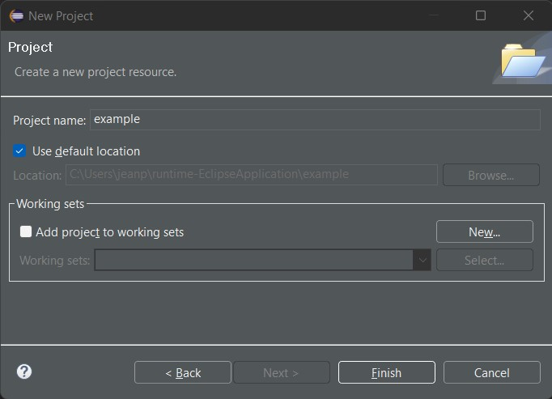

13. Dentro del proyecto creado, creamos un nuevo archivo de tipo **EMF Model** accediendo a la opción **File > New > Other** y seleccionamos la opción **EMF Model Creation Wizard**. Luego definimos un nombre en la ventana seleccionamos la opción **Next**.

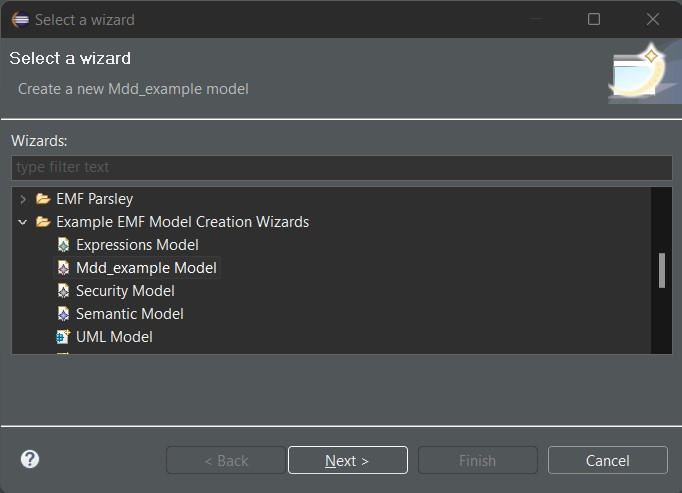

14. Damos click en **Next**

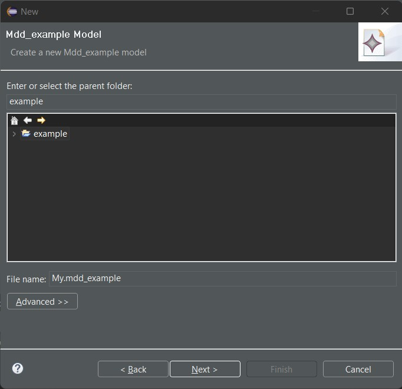

15. Elegimos el modelo que deseamos crear y damos click en **Finish**. Se nos creara en el proyecto la entidad seleccionada

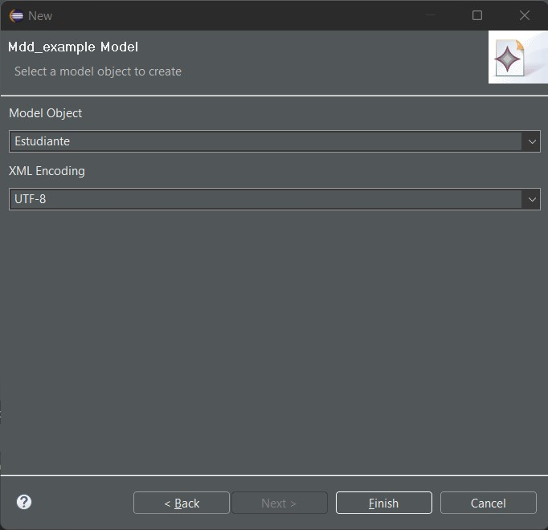

16. Para generar la relación damos click derecho sobre la entidad y seleccionamos la opción **New Child > entity**. Validadndo que esta se agrega en nuestro tree

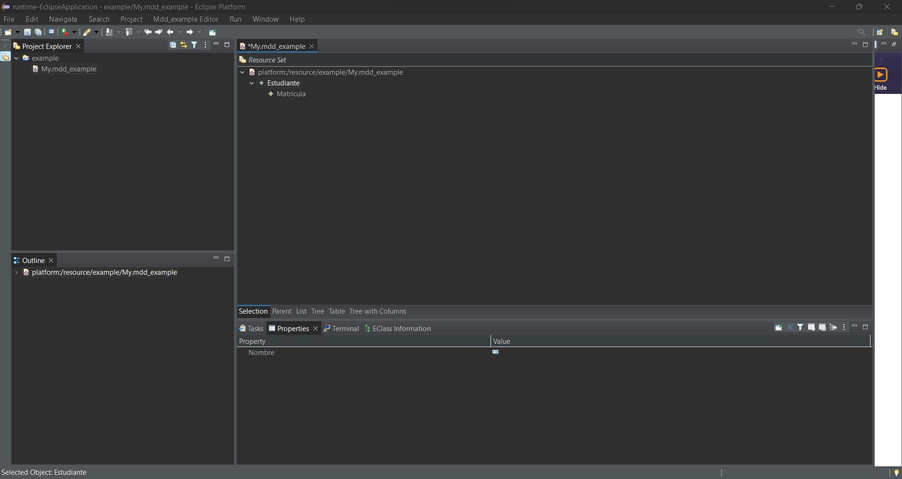

17. Definimos los datos para cada atributo en el **panel inferior** en el campo **value**

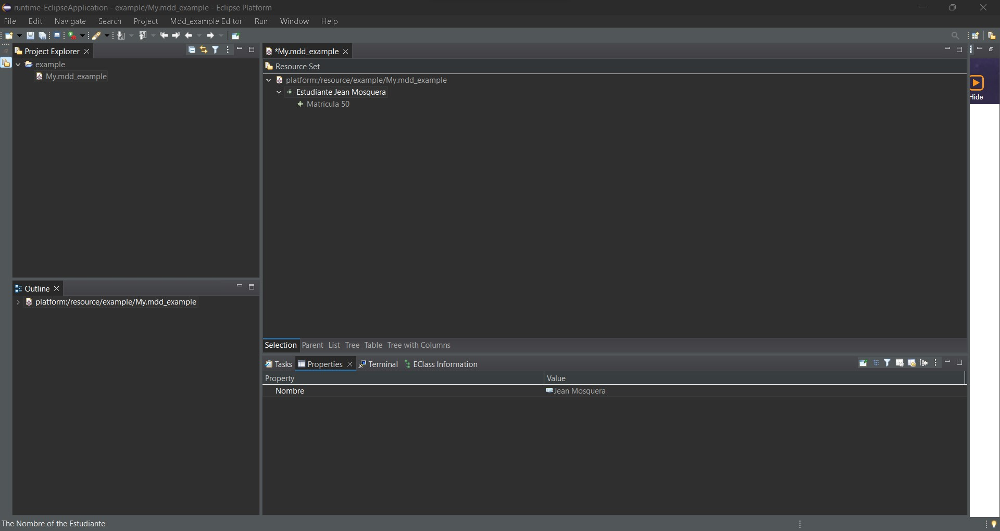

