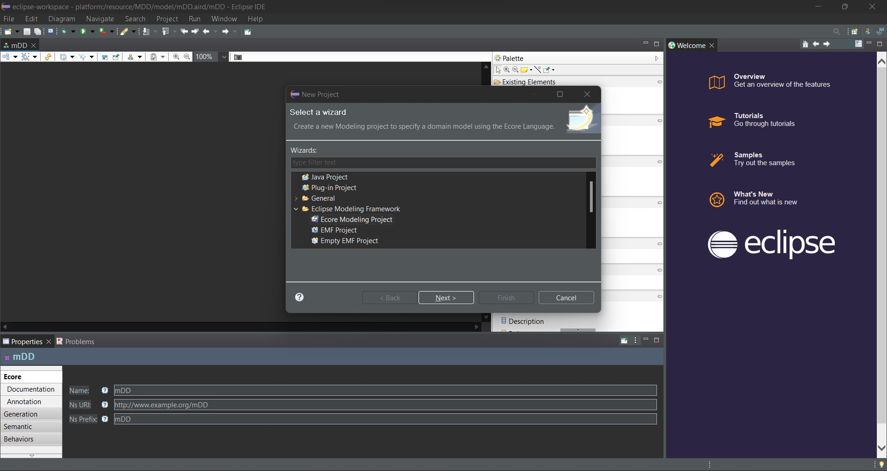
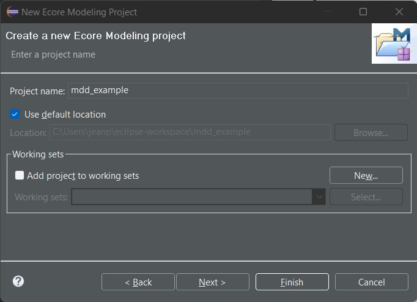
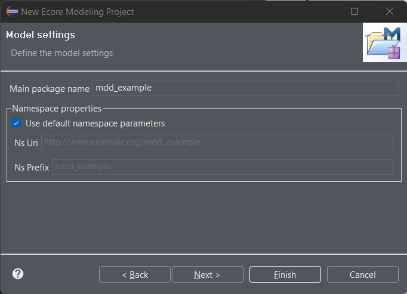
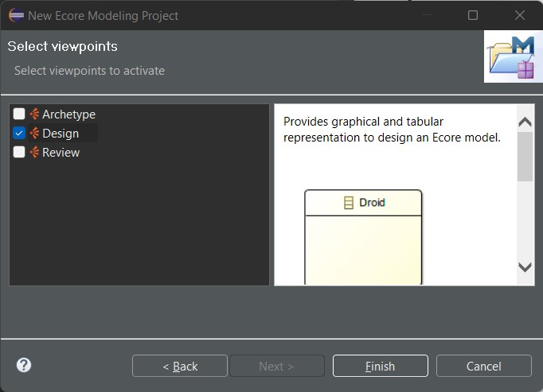
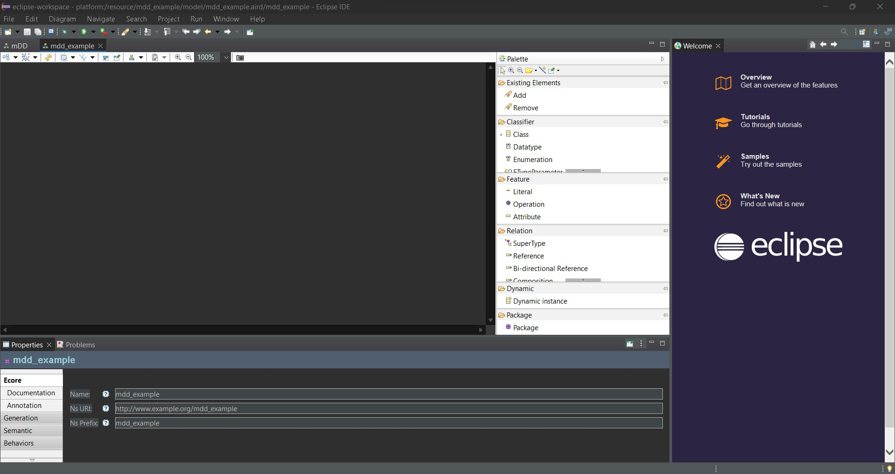

# Generar un nuevo proyecto de Ecore Modeling

Una vez obtenidos los plugins de Eclipse instalados en el paso previo, se puede proceder a crear un nuevo proyecto de Ecore Modeling. Para ello, se debe seguir los siguientes pasos:

1. Crear un nuevo proyecto de tipo **Eclipse Modeling Project**. Para ello, se debe seleccionar la opción **File > New > Project** y seleccionar la opción **Eclipse Modeling Project**. Luego seleccionar la opción **Next**.
 

2. Definimos un nombre para el proyecto y seleccionamos la opción **Next**.

3. Seleccionar la opción **Next**.

4. Definir que **View Types** se requieren y  Seleccionar la opción **Next**.

5. Seleccionar la opción **Finish**. Hemos gnerado el proyecto de Ecore Modeling con éxito.

